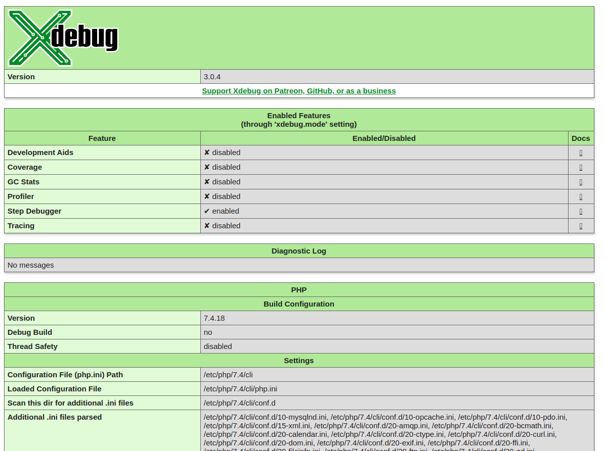
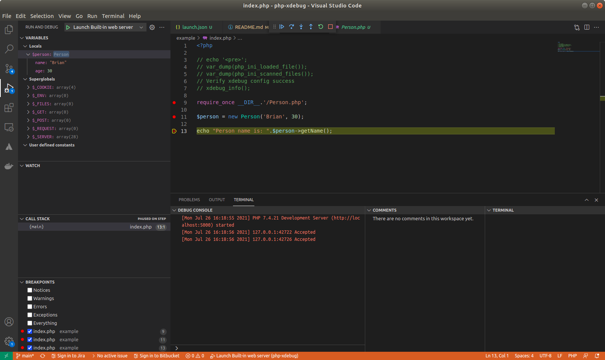

# Debug PHP application with Xdebug and VsCode

In this project, we will learn how to debug php application use Xdebug.

We tested on environment as follows:

- PHP 7.4+
- Visual Code
- PHP Debug extension (by Felix Backer)

Screenshot

**Xdebug info**



**VSCode xDebug**



## Install XDebug

Step 1: Install xdebug for linux/ubuntu

follow instruction on this page

https://xdebug.org/docs/install

```shell
# Ubuntu (18.04 LTS/Bionic, 20.04 LTS/Focal):
sudo apt-get install php7.4-xdebug
```

Step 2: Configure PHP

To find out which php.ini file to modify, run a script with the following:

```php
<?php
var_dump(php_ini_loaded_file(), php_ini_scanned_files());
```

Enable xdebug extension

```shell
cd /etc/php/7.4/cli/conf.d
echo "zend_extension=xdebug.so" > 20-xdebug.ini
```

Restart your webserver, or PHP-FPM, depending on what you are using.

```shell
sudo service php7.4-fpm restart
sudo service apache2 restart
```

Step 3: Verify xdebug enabled

On the command line, you can also run `php -v`. Xdebug and its version number should be present as in:

```
PHP 7.4.10 (cli) (built: Aug 18 2020 09:37:14) ( NTS DEBUG )
Copyright (c) The PHP Group
Zend Engine v3.4.0, Copyright (c) Zend Technologies
  with Zend OPcache v7.4.10-dev, Copyright (c), by Zend Technologies
  with Xdebug v3.0.0-dev, Copyright (c) 2002-2020, by Derick Rethans
```

Step 4: Enable xdebug features

Xdebug have some features as follows:

- Development Aids
- Coverage
- GC Stats
- Profiler
- Step Debugger
- Tracing

To enabled Features we need to add it through 'xdebug.mode' setting


```shell
nano /etc/php/7.4/cli/php.ini

# Add this line
xdebug.remote_enable=1
xdebug.remote_autostart=1
# xdebug.mode
```

Step 4: Config VSCode use xdebug

Next, we will create VSCode lauch.json and config our web run on `localhost:5000`.

1. Lef Menu \ RUn & Debug \ create a lauch.json file.

2. Find this line "Launch Built-in web server"

  Change `localhost:0` to `localhost:5000`


```shell
"runtimeArgs": [
    "-dxdebug.mode=debug",
    "-dxdebug.start_with_request=yes",
    "-S",
    "localhost:5000" # run on dev server port 500
],
"program": "",

# application root with: index.php 
"cwd": "${workspaceRoot}/example",
```

Step 5: Run debug

1. Open new window and open project we need to debug
2. Open Run & Debug on left side
2. Select `Launch Built-in web server`
3. Click play button.

Debug application started at: http://localhost:5000/

## Reference

- https://xdebug.org/docs/install